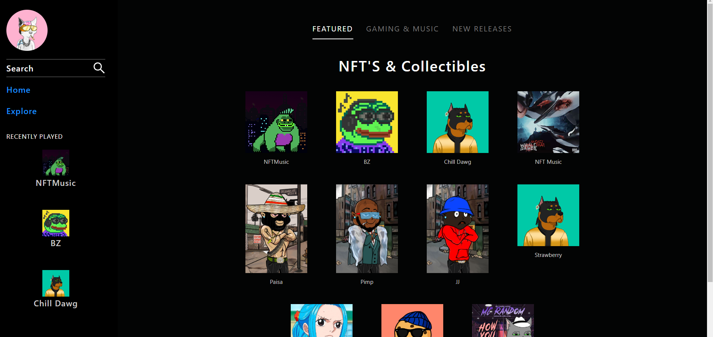

# NFT-Market

This application is able to mint your own nft by pushing your music and picture files through meta-data.
Using an array to export the music and picture files into metadata is innovative; we then use this json stringified information to create smart contracts that contain this information that is now available in the blockchain, our application is able to play the music files on a sticky web player, and now were working on connecting the metamask wallet, then people are able to purchase the nft directly from us not just openSea

